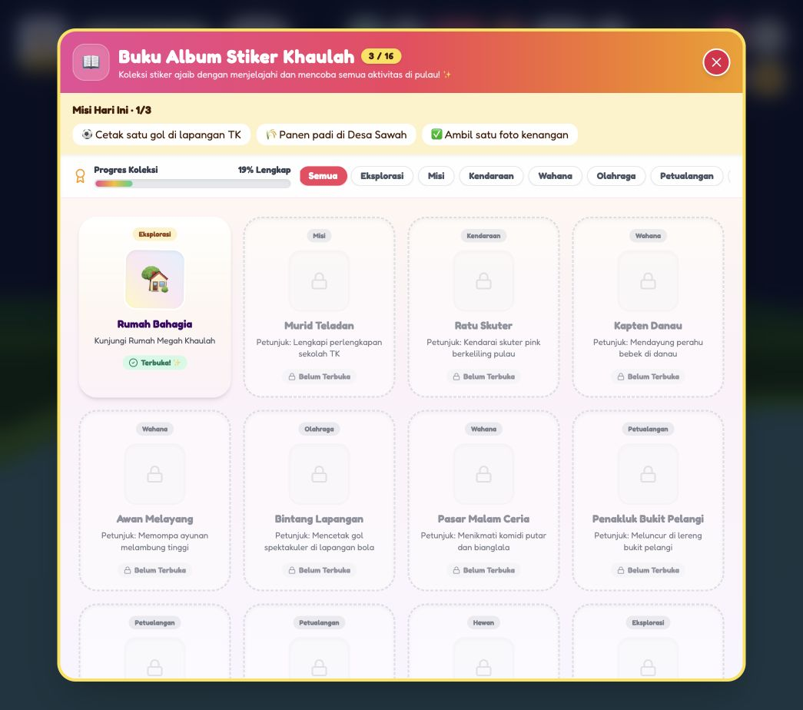

# Audit upgrade Dunia Bahagia Khaulah 3D

Pemeriksaan pada 7 Oktober 2026 membandingkan rencana lima fase, laporan implementasi sebelumnya, dan kode aktual. Ada fitur yang memang sudah dibuat, tetapi klaim “semuanya selesai” dan “60 FPS stabil” belum didukung verifikasi yang memadai.

## Perbaikan dalam audit ini

- Interior rumah dikenali dari batas ruangan, bukan `x > 100`. Teleport ke Bukit Pelangi tidak lagi mengaktifkan kamera/interaksi rumah. Titik teleport bukit ditempatkan di atas lantai puncak.
- Zona baru terhubung oleh tanah yang memiliki mesh dan collider. Tangga kecil memberikan akses berjalan ke puncak bukit; seluncuran dapat dinaiki dan jalurnya mengikuti sisi teras.
- Balon tetap tampil ketika dinaiki. Aksi E dan tombol sentuh berfungsi; tombol turun memakai titik pendaratan aman, bukan menjatuhkan pemain dari udara. Timer perjalanan direset untuk perjalanan berikutnya.
- Gawang dipindahkan dari collider gedung sekolah ke sisi lapangan yang bisa diakses. Gol membutuhkan bola melintasi mulut gawang dari depan pada lebar dan tinggi yang sesuai, termasuk ketika bola bergerak cepat. Bola sepak yang jatuh keluar dunia dikembalikan ke titik awal.
- Rapier memakai langkah simulasi tetap. Collider lingkungan disinkronkan saat data berubah, tanpa jeda startup 1,2 detik. Lantai fisika tak terlihat seluas 800 meter dihapus. Proxy pemain tidak menyapu seluruh dunia saat teleport.
- Arah pompa ayunan pada joystick diperbaiki. Stiker ayunan diberikan setelah mencapai amplitudo yang cukup. Jungkat-jungkit bergerak ke sisi berat pemain dan memiliki penopang tabrakan yang mengikuti kursinya.
- Gerakan analog tidak lagi mengalikan kekuatan joystick dua kali. Es memiliki gesekan lebih rendah. Menahan tombol lompat tidak lagi mengisi ulang jump buffer terus-menerus.
- Jumlah rumput yang dibuat dan dirender mengikuti kualitas grafis; gerakan angin diproses GPU, bukan menghitung ulang ribuan matriks di CPU setiap frame.
- Air memiliki normal permukaan yang diperbarui, tingkat detail berdasarkan kualitas, dan batas pembaruan animasi. Geometri sementara dibuang setelah digunakan.
- Samudra dipindahkan ke sebelah pantai karena sebelumnya tersembunyi di bawah tanah pasir. Samudra memiliki dasar dan zona berenang; dermaga tersambung ke pantai. Peta memakai batas dunia yang diperluas.
- Hujan/salju mengikuti posisi aktual pemain, tidak jatuh di interior, dan tidak memakai batas culling lama setelah partikel berpindah. Pelangi muncul pada cuaca pelangi.
- Foto dirender dan disalin sebelum buffer WebGL dibuang. PNG berisi bingkai, filter, stiker, dan judul; tersedia pratinjau dan pesan kegagalan yang benar. Tidak perlu mengaktifkan `preserveDrawingBuffer` sepanjang permainan. Pemain, kamera, dan Rapier berhenti ketika mode foto terbuka.
- Modal baru saling menutup dan mereset input. Escape serta tombol shortcut yang sama dapat menutup peta, buku stiker, dan mode foto.
- Misi harian gol, panen, dan foto ditambahkan ke buku stiker; progres tersimpan dan berganti menurut tanggal lokal perangkat, termasuk jika stikernya sudah dimiliki.
- Save stiker divalidasi terhadap katalog. Progres misi sekolah juga disimpan dan diperiksa prasyaratnya saat dimuat. Posisi saat menaiki wahana tidak menimpa save posisi aman. Boneka salju yang sudah dibangun muncul kembali setelah reload.
- Rapier dimuat sebagai chunk terpisah. Bundle utama sekitar 1,64 MB, dibanding laporan sebelumnya sekitar 3,71 MB; total unduhan tetap sekitar 3,73 MB sebelum gzip karena mesin fisika masih besar.

## Verifikasi

`npm test` memeriksa transisi lokasi, modal/input, prasyarat misi, batas efek, ID unik, notifikasi no-op, gol dari arah yang benar, zona samudra, keluar wahana dengan aman, pemulihan save rusak, progres sekolah dan misi harian, serta mantra offline.

`npm run build` memeriksa TypeScript dan menghasilkan build produksi. Vite masih memperingatkan ukuran chunk besar. Browser yang diperiksa tidak memunculkan error runtime.

Pemeriksaan browser mencakup membuka game, teleport ke Bukit Pelangi dan dermaga balon, menaiki balon, foto dengan judul/filter/stiker, serta progres misi harian pada buku stiker.

## Batas hasil

- FPS, konsumsi baterai, dan performa perangkat seluler belum diukur. Tidak ada jaminan 60 FPS; angka tersebut sudah dihapus dari label kualitas.
- Pemain dan kendaraan menggunakan pengendali gerak manual yang disempurnakan. Rapier menangani benda dinamis. Ini bukan migrasi seluruh wahana ke rigid body dan joints Rapier.
- Air memakai gelombang geometri dan pencahayaan material; tidak ada pantulan planar atau screen-space reflection.
- Dunia memakai mesh dan teras prosedural; belum berupa terrain organik kontinu. Karakter tetap prosedural, tanpa migrasi ke aset karakter eksternal atau peningkatan model seluruh keluarga.
- Tiga misi harian sederhana memakai daftar aktivitas tetap dan reset tanggal. Belum ada rotasi tantangan atau sistem hadiah harian terpisah.
- Pemeriksaan browser merupakan smoke test, bukan pengujian manual lengkap setiap wahana dan setiap perangkat.

Dengan demikian, implementasi sekarang lebih benar dan sejumlah kekurangan gameplay sudah dilengkapi, tetapi laporan sebelumnya tidak sebaiknya dipakai sebagai bukti bahwa seluruh ambisi lima fase sudah tercapai tanpa batasan.
